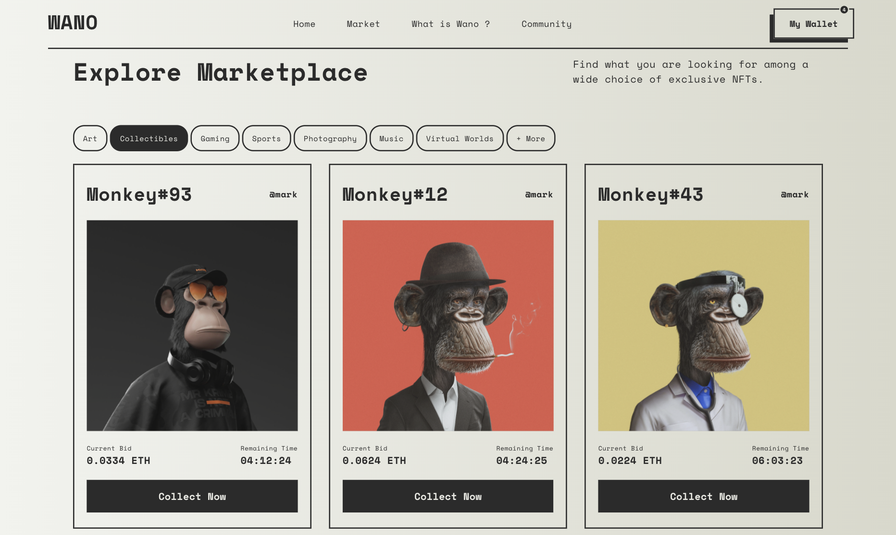

# **`WANO - NFTs Market Place`**

For demonstrative purposes.

## **`🐒 What is WANO ?`**

**WANO** is a market place for collecting NFTs and digital artworks. The application allows you to explore a wide range of works, become a creator and get in touch with the **WANO** community.



## **`🚀 Challenge`**

1- Produce the desktop version from a given graphic model (https://dribbble.com/shots/18115431-NFTs-Landing-Page).

2 - Design the unexistant mobile version (bottom navigation, vertical layer, horizontal scrollers, etc...) and implement responsive functions.

3 - Animate the application with simple JS functions (header, bottom navigation, modals, etc ...).

4 - Ensure compatibility on different browsers and devices.

## **`⚙️ Technical approach`**

-   `GulpJS` `Twig` `Sass` `ES6`
-   Mobile first.
-   Responsive design.
-   Reusable components (buttons, tabs, sections, ... ).
-   SEO friendly.
-   Browsers compatible.

Pieces of the cake :

```twig
<nav class="nav is-main" arial-label="main">
    <div class="nav_container">
        <ul class="list">
            
                <li class="list_item">
                    <a href="{{ item.path ? '#' ~ item.path : '' }} title="{{ item.label }}" class="list_itemLink">
                        {{ item.label }}
                    </a>
                </li>
            
        </ul>
    </div>
</nav>
```

```javascript
window.addEventListener("DOMContentLoaded", (event) => {
    const tabs = document.querySelectorAll(".tab_trigger");

    for (tab of tabs) {
        tab.onclick = function () {
            this.classList.toggle("is-active");
        };
    }
});
```

## **`🔗 Let's Connect`**

> Meet me on Malt : https://www.malt.fr/profile/thomasbarnabe

[](https://www.linkedin.com/in/thomasbarnab%C3%A9/)
